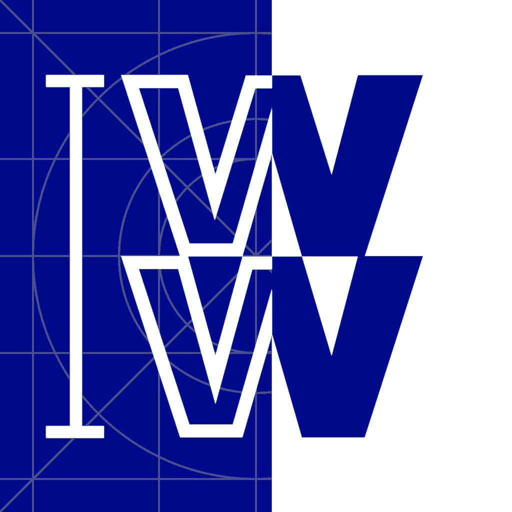

<p align="center">
    
</p>
<h1 align="center">WWLayout</h1>
<p align="center">
    <!--
    <a href="https://circleci.com/gh/WW-Tech/wwlayout"></a>
    <a href="https://codeclimate.com/repos/5bd1ca9c535ea53834001d51/maintainability"></a>
    <a href="https://codeclimate.com/repos/5bd1ca9c535ea53834001d51/test_coverage"></a>
    -->
    <a href="https://developer.apple.com/swift"></a>
</p>

Easy to write auto layout constraints, with minimal extensions to standard namespaces.

## Feature Highlights
* Easy to use, readable API
* Backwards-compatible (i.e. pre iOS 11) Safe Area constraints
* Tag constraints to easily switch between different layouts (coming soon)
* Automatic switching of size-class based constraints (coming soon)

## Introduction

Constraints are added to a view using the view's `layout` property, like so:

```swift
    myView.layout.width(400)
```

Multiple constraints are easily added by chaining calls:

```swift
    myView.layout.width(400).height(200)
```

A more complicated example:

```swift
    let container = UIView()
    let child = UIView()

    container.layout.fill(.safeArea)

    child.layout
      .fill(container, axis: .x, inset: 20)
      .center(in: container, axis: .y, priority: .high)
      .top(.lessOrEqual, to: container, offset: 100)
      .height(toWidth: 0.5)
```

## Dcumentation

### [Documentation can be found here](//ww-tech.github.io/wwlayout/)


## Installation

### Cocoapods

Simply add WWLayout to your `Podfile`:

```
  pod 'WWLayout'
```

## Contributing

## Authors
* [Steven Grosmark](https://github.com/g-mark), steven.grosmark@weightwatchers.com
* WW iOS Team

## License
WWLayout is © copyright by WW International.

WWLayout is licensed under the [Apache-2.0 Open Source license](http://choosealicense.com/licenses/apache-2.0/).
